# Portugal Data Intelligence

**A comprehensive macroeconomic analytics platform for the Portuguese economy (2010-2025)**

[](https://github.com/diogomserino/Portugal-Data-Intelligence/actions/workflows/ci.yml)


**[View Live Report →](https://diogomserino.github.io/Portugal-Data-Intelligence/)**


---

## Executive Summary

Portugal Data Intelligence is an end-to-end data analytics solution that examines the structural evolution of the Portuguese economy across **twelve macroeconomic pillars** plus regional NUTS2 analysis. The platform ingests data from authoritative national and European statistical sources, applies rigorous ETL processes, and delivers AI-augmented insights through interactive dashboards and executive-grade reports.

Designed to demonstrate professional-grade data engineering, analytical rigour, and business intelligence delivery, this project follows methodologies consistent with Big Four consulting engagements in economic advisory and public sector analytics.

### Key Objectives

- **Consolidate** macroeconomic data from multiple Portuguese and European statistical authorities
- **Analyse** structural trends, cyclical patterns, and cross-pillar correlations across a 15-year horizon
- **Benchmark** Portugal against EU-27 averages across key normalised indicators
- **Generate** AI-powered narrative insights using large language models
- **Deliver** boardroom-ready reports via Power BI, interactive Streamlit dashboard, and self-contained HTML
- **Monitor** data quality, drift detection, and configurable alert thresholds

---

## Sample Outputs

### Economic Dashboard

A single-view summary of the six core macroeconomic pillars — GDP, unemployment, credit, interest rates, inflation, and public debt — spanning 2010 to 2025.

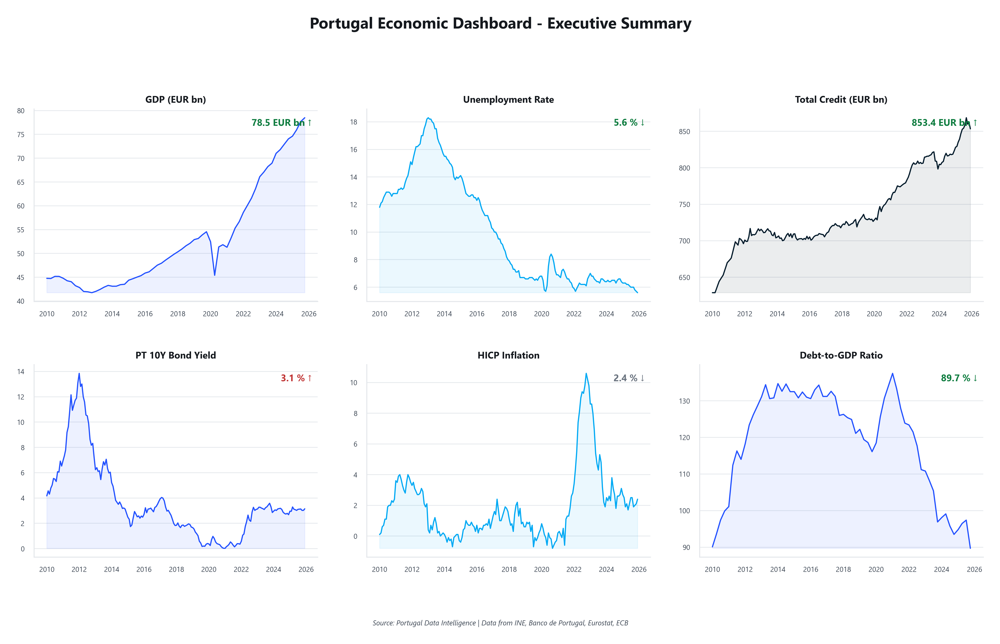

### Cross-Pillar Correlation Analysis

Pearson correlation matrix revealing how Portugal's key economic indicators interact — from the unemployment-bond yield link (0.71) to the inflation-NPL inverse relationship (-0.48).

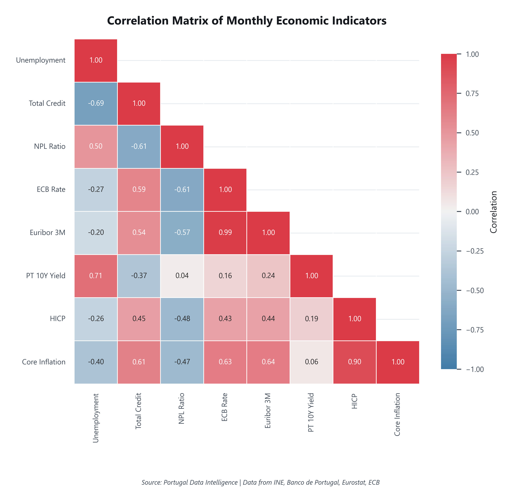

### Portugal vs EU Benchmark

Radar chart comparing Portugal against the EU-27 average across five normalised indicators (2025). Highlights areas of convergence and divergence with European peers.

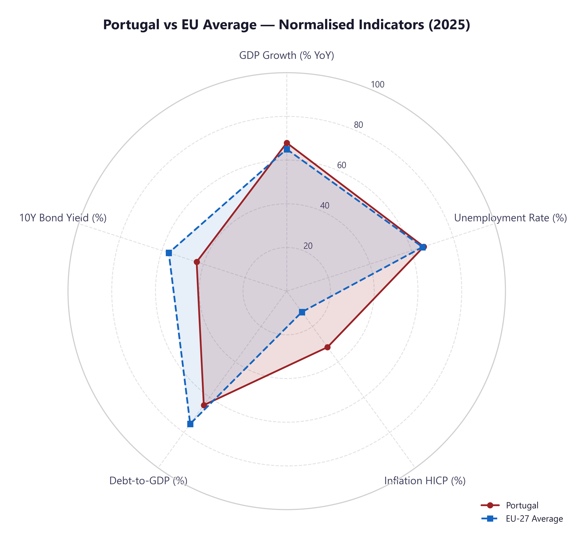

### GDP Evolution

Real GDP trajectory from 2010 to 2025, capturing the sovereign debt crisis, the recovery cycle, the COVID-19 shock, and the post-pandemic rebound.

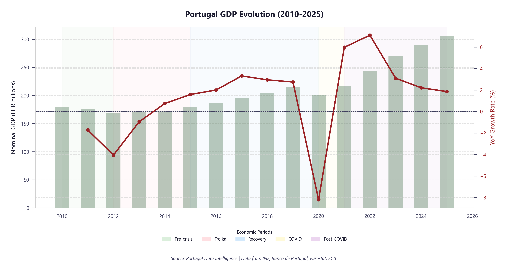

### Unemployment Trends

Monthly unemployment rate with structural trend overlay — from the 18.3% crisis peak to the current historic lows near 5.6%.

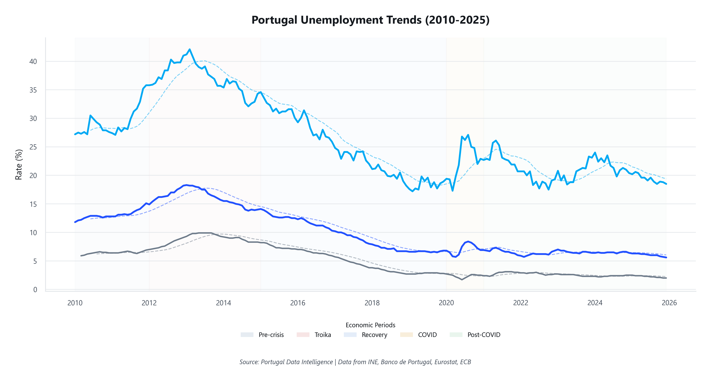

### Credit Portfolio

Total credit to the economy including corporate lending, household mortgages, consumer credit, and the NPL ratio trajectory.

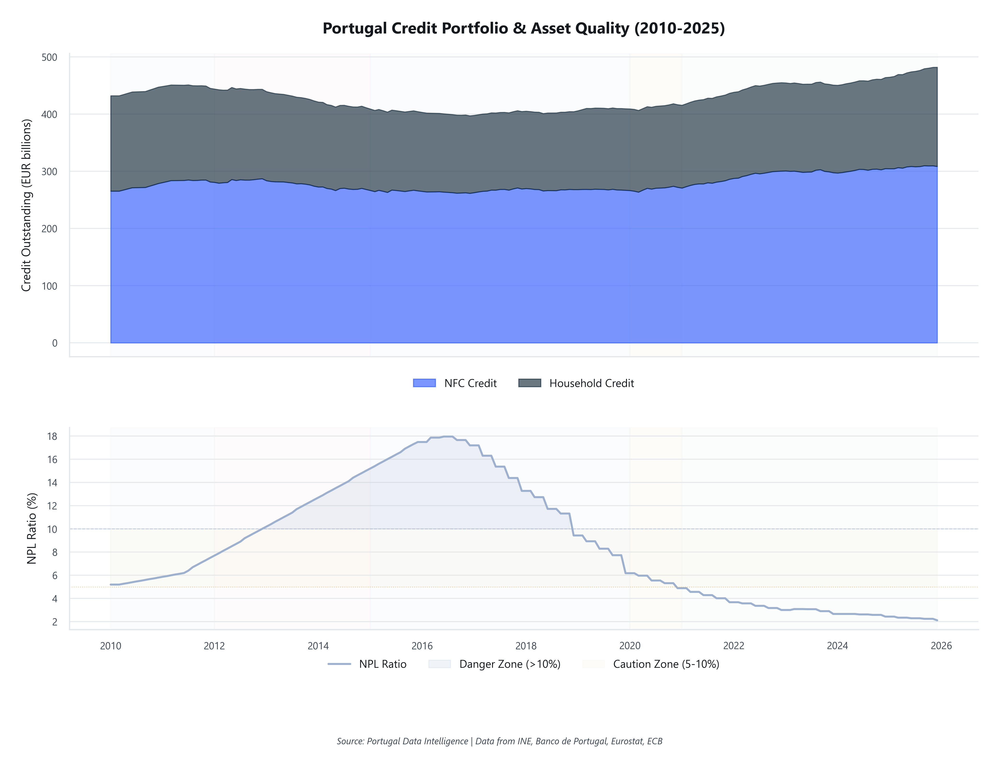

### Interest Rate Environment

ECB policy rates, Euribor benchmarks, and Portugal's 10-year sovereign bond yield — mapping the full monetary policy cycle from crisis-era divergence to normalisation.

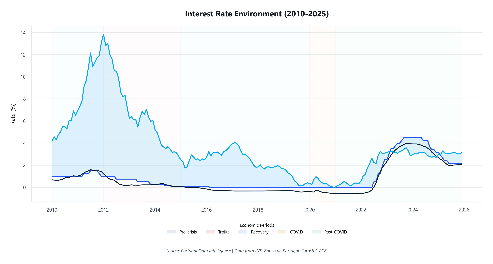

### Inflation Dashboard

HICP inflation and estimated CPI with trend decomposition, capturing the 2022 energy-driven spike and the return toward the ECB's 2% target.

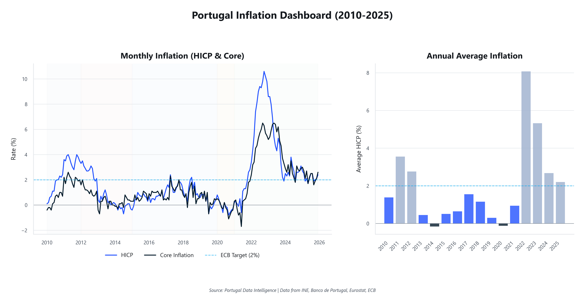

### Public Debt Sustainability

Debt-to-GDP ratio evolution with budget balance dynamics — from the 137.5% peak to the ongoing consolidation path.

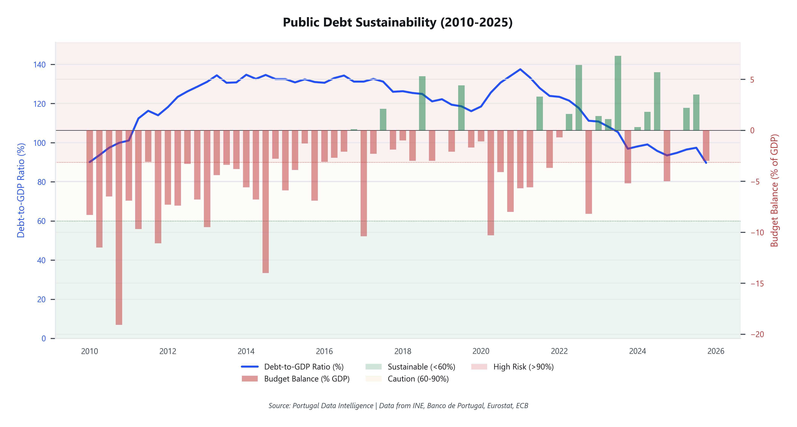

### Phillips Curve

Unemployment vs inflation scatter plot revealing the structural trade-off and regime shifts across the 2010-2025 period.

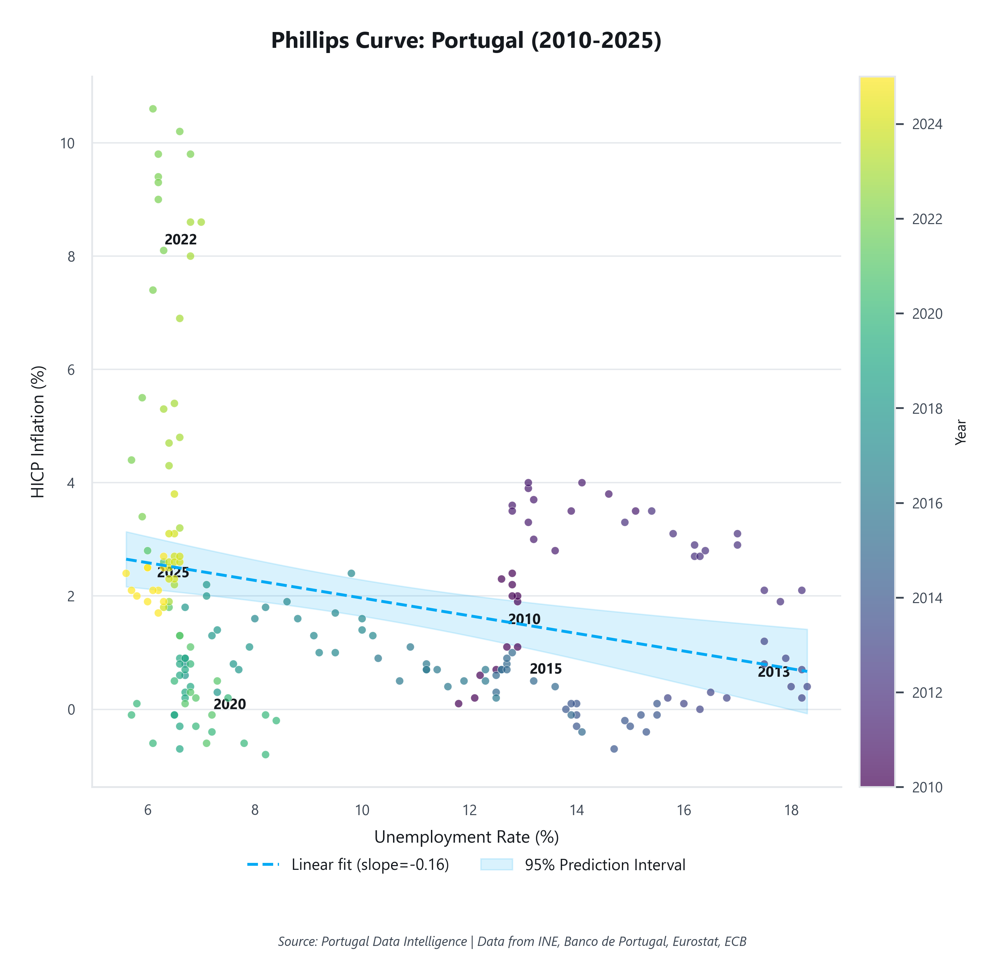

### Crisis Timeline

Multi-indicator timeline overlaying GDP growth, unemployment, inflation, and bond yields to visualise how Portugal's key economic variables co-moved across major crisis episodes.

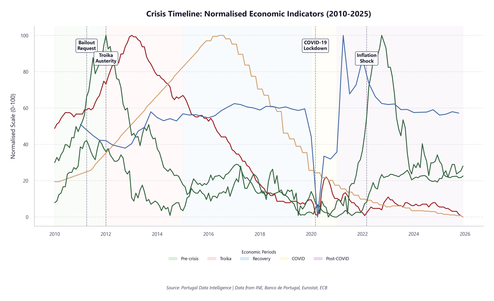

### EU Benchmark — Small Multiples

Peer country comparison across key indicators, placing Portugal's performance in context alongside EU economies.

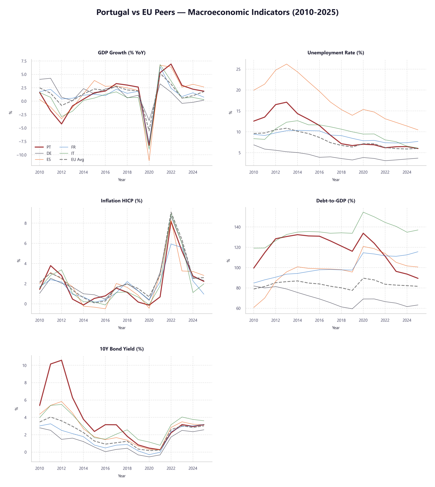

### Interactive Streamlit Dashboard

Four-page interactive dashboard with real-time KPI cards, pillar deep-dive with configurable filters, cross-pillar correlation analysis, and a raw data explorer.

> Launch with: `streamlit run dashboard/app.py` | API docs at: `uvicorn api.main:app --reload` then visit `/docs`

> All charts are generated programmatically by the pipeline (`python main.py --mode analysis`) at 300 DPI.

---

## Architecture Overview

```
 DATA SOURCES                ETL PIPELINE               ANALYTICS LAYER            OUTPUT
+------------------+    +--------------------+    +----------------------+    +------------------+
|  INE             |    |                    |    |                      |    |  Power BI        |
|  Banco de        |--->|  Extract (CSV/API) |--->|  Statistical         |--->|  Dashboards      |
|  Portugal        |    |  Transform (Clean) |    |  Analysis (12 pillars)|   |                  |
|  PORDATA         |    |  Load (SQLite)     |    |                      |    |  Streamlit       |
|  Eurostat        |    |  Data Quality Gate |    |  AI Insight          |    |  Dashboard       |
|  ECB             |    |  Lineage Tracking  |    |  Generation          |    |                  |
+------------------+    +--------------------+    |                      |    |  HTML Report     |
                                                  |  STL Decomposition   |    |  (Plotly interac)|
                                                  |  SARIMAX + Cache     |    |                  |
                                                  |  VAR / Granger       |    |  REST API        |
                                                  |  Nowcasting          |    |  (FastAPI)       |
                                                  |  Anomaly Detection   |    |                  |
                                                  |  Backtesting         |    |  Excel Export    |
                                                  |  Alert Engine        |    |  Regional NUTS2  |
                                                  +----------------------+    +------------------+
                                                           |
                                                  +--------v---------+
                                                  |  SQLite Database  |
                                                  |  12 fact tables   |
                                                  +------------------+
```

---

## Data Pillars

| # | Pillar | Granularity | Period | Primary Source |
|---|--------|------------|--------|----------------|
| 1 | Gross Domestic Product (GDP) | Quarterly | 2010 Q1 - 2025 Q4 | INE / Eurostat |
| 2 | Unemployment | Monthly | Jan 2010 - Dec 2025 | INE / Eurostat |
| 3 | Credit to the Economy | Monthly | Jan 2010 - Dec 2025 | Banco de Portugal |
| 4 | Interest Rates | Monthly | Jan 2010 - Dec 2025 | Banco de Portugal / ECB |
| 5 | Inflation (HICP / CPI estimated) | Monthly | Jan 2010 - Dec 2025 | INE / Eurostat |
| 6 | Public Debt | Quarterly | 2010 Q1 - 2025 Q4 | Banco de Portugal / PORDATA |
| 7 | Housing Market | Annual | 2010 - 2025 | INE / Banco de Portugal |
| 8 | Labour Market Detail | Annual | 2010 - 2025 | Eurostat |
| 9 | External Accounts | Quarterly | 2010 Q1 - 2025 Q4 | ECB / Banco de Portugal |
| 10 | Fiscal Structure | Annual | 2010 - 2025 | Eurostat |
| 11 | Inequality & Income | Annual | 2010 - 2025 | Eurostat |
| 12 | Regional (NUTS2) | Annual | 2010 - 2025 | Eurostat |

**Schema notes:**

- All fact tables include an `is_provisional` flag for marking projected or preliminary rows; in the current synthetic dataset every row is final (the flag is reserved for live-data refreshes).
- GDP growth rates (`gdp_growth_yoy`, `gdp_growth_qoq`) are derived from `real_gdp` during the transform step (not from API nominal growth figures).
- `total_credit` (in `fact_credit`): total financing to the non-financial sector (households, corporations, and general government), so it is larger than `credit_nfc` + `credit_households` (which exclude government).
- `cpi_estimated` (in `fact_inflation`): CPI is estimated from HICP, not sourced directly from INE.
- `external_debt_share_estimated` (in `fact_public_debt`): this field is an estimate, not fetched from an API.
- `budget_deficit_annual` (in `fact_public_debt`): rolling 4-quarter average of the budget balance.
- Regional data covers 7 NUTS2 regions: Norte, Centro, Lisboa, Alentejo, Algarve, Açores, and Madeira.

---

## Data Sources

| Source | Description | URL | Format |
|--------|------------|-----|--------|
| **INE** (Instituto Nacional de Estatistica) | Portugal's national statistics office | [ine.pt](https://www.ine.pt) | CSV / JSON API |
| **Banco de Portugal** | Central bank statistical databases | [bportugal.pt/EstatisticasWeb](https://bpstat.bportugal.pt) | CSV / Excel |
| **PORDATA** | Contemporary Portugal database | [pordata.pt](https://www.pordata.pt) | Excel / CSV |
| **Eurostat** | European statistical office | [ec.europa.eu/eurostat](https://ec.europa.eu/eurostat) | CSV / JSON API |

> **Data note.** The six core pillars (GDP, unemployment, inflation, interest rates, credit, public debt) are fetched from the official Eurostat, ECB, and Banco de Portugal open APIs. The extended pillars (housing, labour detail, external accounts, fiscal, inequality, regional) and the EU benchmark use **modelled estimates** calibrated to published trends where granular data is not available via an open API. The committed dataset is deterministic and reproducible. See [docs/data_provenance.md](docs/data_provenance.md) for the full breakdown.

---

## Tech Stack

| Layer | Technology | Purpose |
|-------|-----------|---------|
| **Language** | Python 3.10+ | Core programming language |
| **Database** | SQLite 3 | Lightweight relational data store |
| **Query Language** | SQL | Schema design, analytical queries, and data aggregation |
| **BI Language** | DAX | 39 Power BI measures across 7 categories |
| **Data Processing** | pandas, NumPy | Data manipulation and numerical computing |
| **Visualisation** | matplotlib, seaborn, Plotly | Statistical and interactive charts |
| **Time Series** | statsmodels | STL decomposition, SARIMAX forecasting |
| **Machine Learning** | scikit-learn, SciPy | Statistical modelling and significance tests |
| **AI Insights** | OpenAI GPT API | Narrative generation and anomaly commentary |
| **HTML Reports** | Python f-strings | Self-contained Big4-style HTML briefings (base64-embedded charts) |
| **Dashboard** | Streamlit, Plotly | Interactive web dashboard (open-source) |
| **BI Dashboard** | Power BI | Interactive executive dashboards |
| **REST API** | FastAPI | Programmatic data access (7 endpoints) |
| **Documentation** | MkDocs | Project documentation site |
| **Containerisation** | Docker | Reproducible pipeline execution |
| **Notebooks** | Jupyter | Exploratory analysis and documentation |

---

## Project Structure

```
portugal-data-intelligence/
├── config/                     # Configuration files, thresholds, and data sources
├── api/
│   └── main.py                 # FastAPI REST API (7 endpoints)
├── dashboard/
│   ├── app.py                  # Streamlit interactive dashboard
│   └── generate_report.py      # Self-contained HTML report generator
├── data/
│   ├── raw/                    # Raw CSV/Excel files from data sources
│   ├── processed/              # Cleaned, validated, and transformed data
│   └── database/               # SQLite database file
├── docs/                       # MkDocs project documentation
├── notebooks/                  # Jupyter notebooks for exploration
├── reports/
│   ├── data_quality/           # Data quality check reports (JSON)
│   ├── insights/               # AI-generated executive briefings (JSON)
│   ├── powerbi/
│   │   ├── charts/             # Generated chart images (300 DPI)
│   │   └── dax/                # DAX measures organised by category
│   └── ad_hoc/                 # Ad-hoc analysis outputs
├── sql/
│   ├── ddl/                    # CREATE TABLE, seed scripts
│   └── queries/                # Analytical SQL queries (13 query files)
├── src/
│   ├── alerts/                 # Configurable threshold alert engine
│   ├── ai_insights/            # AI-powered insight generation (modular)
│   │   ├── ai_narrator.py      # GPT-4 integration
│   │   ├── insight_engine.py   # Core engine and executive briefings
│   │   ├── pillar_insights.py  # Per-pillar rule-based narratives
│   │   └── cross_pillar_insights.py  # Cross-pillar analysis
│   ├── analysis/               # Statistical analysis and visualisations
│   │   ├── backtesting.py      # Expanding-window forecast validation
│   │   ├── decomposition.py    # STL seasonal-trend decomposition
│   │   ├── ensemble_forecast.py # Multi-model ensemble forecasting
│   │   ├── forecasting.py      # SARIMAX forecasting with AIC + model cache
│   │   ├── var_analysis.py     # VAR, IRF, FEVD, Granger causality
│   │   ├── nowcasting.py       # Bridge-equation GDP nowcast
│   │   ├── anomaly_detection.py # Z-score + Isolation Forest detection
│   │   ├── housing_analysis.py # Housing market pillar
│   │   ├── labor_analysis.py   # Labour market detail pillar
│   │   ├── external_analysis.py # External accounts pillar
│   │   ├── fiscal_analysis.py  # Fiscal structure pillar
│   │   ├── inequality_analysis.py # Inequality & income pillar
│   │   ├── regional_analysis.py # NUTS2 regional analysis
│   │   └── ...                 # Correlation, benchmarking, scenarios
│   ├── etl/                    # Extract, Transform, Load pipeline
│   │   ├── api_cache.py        # Disk-based API response cache
│   │   ├── data_quality.py     # 15+ validation checks with JSON reports
│   │   ├── lineage.py          # Batch tracking and data provenance
│   │   └── ...                 # Extract, transform, load, fetch
│   ├── reporting/              # Report generation
│   │   ├── excel_export.py     # Multi-sheet Excel workbook export
│   │   └── shared_styles.py    # Chart colours, fonts, matplotlib config
│   └── utils/
│       ├── db.py               # Centralised database connection manager
│       ├── exceptions.py       # Custom exception hierarchy (PDIBaseError)
│       └── logger.py           # JSON logging with correlation IDs
├── tests/                      # 38 test files, 489 tests
├── Dockerfile                  # Container image for pipeline execution
├── docker-compose.yml          # Docker Compose orchestration
├── Makefile                    # Task automation (make run, make test, etc.)
├── mkdocs.yml                  # Documentation site configuration
├── main.py                     # Single entry point for the full pipeline
├── pyproject.toml              # Project metadata and tool configuration
└── requirements.txt            # Python dependencies
```

---

## Quick Start

```bash
# One command to run everything (rebuilds from the committed raw snapshot — offline & deterministic)
python main.py

# Or run specific stages
python main.py --mode etl        # Rebuild the database from the raw snapshot
python main.py --mode analysis   # Statistical analysis + chart generation
python main.py --mode reports    # AI insights, briefing + HTML report
python main.py --mode quick      # ETL + Analysis (skip reports)
python main.py --mode excel      # Export all pillar data to Excel workbook
python main.py --refresh         # Re-fetch live data from the APIs (instead of the snapshot)
python main.py --list            # Show all available modes

# Generate self-contained HTML report
python dashboard/generate_report.py
```

### Using Make

```bash
make run             # Full pipeline
make etl             # ETL only
make analysis        # Analysis + charts only
make reports         # Reports + insights only
make test            # Run test suite with coverage
make lint            # Code quality checks (black, isort, flake8)
make format          # Auto-format code
make docs            # Build MkDocs documentation site
make report-html     # Generate HTML report
make clean           # Remove generated files and caches
```

### Using Docker

```bash
docker-compose up    # Run full pipeline in container
```

---

## Installation

### Prerequisites

- Python 3.10 or higher
- pip (Python package manager)
- Power BI Desktop (optional, for dashboard viewing)

### Setup

```bash
# Clone the repository
git clone https://github.com/diogomserino/Portugal-Data-Intelligence.git
cd Portugal-Data-Intelligence

# Create a virtual environment
python -m venv venv
source venv/bin/activate        # Linux / macOS
venv\Scripts\activate           # Windows

# Install dependencies
pip install -r requirements.txt

# (Optional) Install dev dependencies (testing, linting, type checking)
pip install -r requirements-dev.txt

# (Optional) Configure AI insights
cp .env.example .env
# Edit .env and add your OpenAI API key — rule-based insights work without it
```

### Running the Pipeline

```bash
# Run the full pipeline with a single command
python main.py

# Run tests
pytest
```

---

## Key Features

### 12 Data Pillars + Regional NUTS2 Analysis
Twelve pillars: GDP, unemployment, credit, interest rates, inflation, public debt, housing market, labour detail, external accounts, fiscal structure, inequality, and regional NUTS2 analysis covering all 7 Portuguese regions.

### EU Benchmarking
Compares Portugal against EU-27 averages across GDP growth, unemployment, inflation, debt-to-GDP, and interest rates — with radar charts and small multiples for visual comparison.

### Cross-Pillar Correlation Analysis
Pearson correlation matrix across all pillars, revealing structural relationships like the unemployment-bond yield link and the inflation-NPL inverse dynamic.

### AI-Powered Insights
Rule-based insight engine with optional OpenAI GPT-4 integration for automated executive briefings, anomaly detection, and narrative commentary. Modular architecture with separate pillar, cross-pillar, and AI narrator components.

### Interactive HTML Report with Plotly
Big4 consulting-style HTML briefing with interactive Plotly charts (zoom, hover, tooltips) and base64-embedded PNG charts. All images are embedded in a single HTML file; the interactive Plotly charts and the web font load from a CDN, so full interactivity requires an internet connection (embedded content renders offline).

### Excel Export
Multi-sheet Excel workbook (`python main.py --mode excel`) with one sheet per pillar, a correlation matrix sheet, and formatted KPI summaries.

### VAR / Granger Causality Analysis
Vector Autoregression (VAR) model for cross-pillar dynamics: impulse response functions (IRF), forecast error variance decomposition (FEVD), and Granger causality tests between GDP, unemployment, inflation, and public debt.

### Nowcasting
Bridge equation nowcasting for GDP: uses monthly industrial production and credit data to estimate the current quarter's GDP growth before official release.

### Anomaly Detection
Rolling z-score (24-month window) and Isolation Forest multivariate anomaly detection across all pillars, with integration into the alert engine.

### STL Decomposition
Seasonal-trend decomposition (STL) for unemployment, inflation, and GDP series with 3-panel diagnostic charts isolating trend, seasonal, and residual components.

### Forecasting & Backtesting
SARIMAX forecasting with automatic order selection via AIC, model-cache persistence (7-day TTL via joblib), and Ljung-Box residual diagnostics. Expanding-window backtesting with MAE, RMSE, MAPE, and directional accuracy metrics.

### Data Quality & Lineage
15+ automated validation checks (schema, ranges, completeness, consistency, freshness) with JSON reports. Full batch tracking with UUID-based `run_id`, SHA-256 file checksums, and provenance metadata.

### Alert Engine
Configurable threshold monitoring with warning/critical severity levels across all twelve economic pillars. JSON output for integration with external notification systems.

### 39 DAX Measures
Complete Power BI analytical layer with KPI measures, year-on-year growth calculations, moving averages, derived cross-pillar metrics, period comparisons, and conditional formatting.

### Scenario Analysis
Data-driven scenario analysis (baseline, optimistic, pessimistic) with calibrated coefficients (Okun's law, credit-rate elasticity) for key economic indicators.

---

## Licence

This project is licenced under the MIT Licence. See `LICENCE` for details.

## Author

Built as a professional portfolio project demonstrating end-to-end data analytics capabilities — from raw data ingestion to executive-ready deliverables.

---

2026 © Diogo Serino
